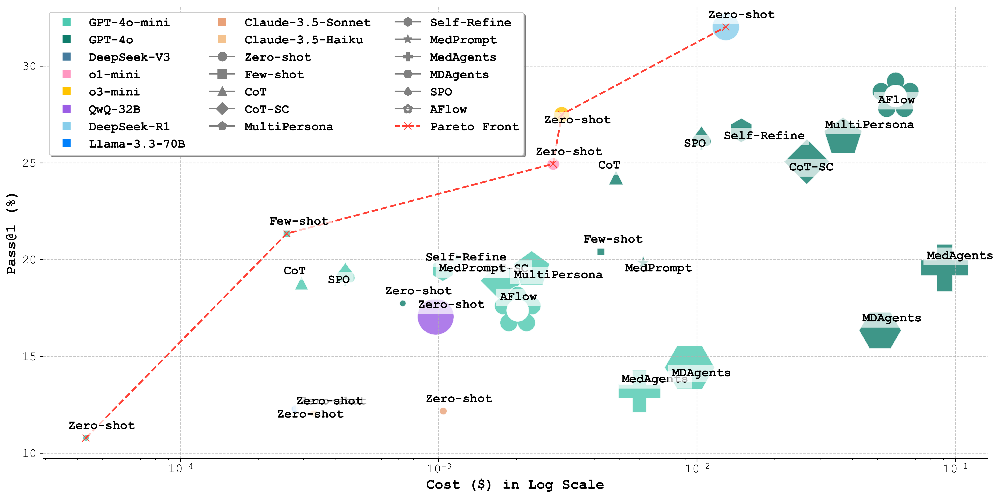
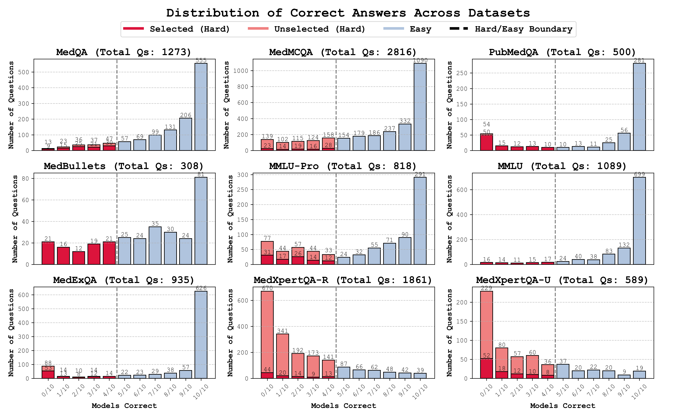

# MedAgents-Benchmark

This repository contains the evaluation benchmark for medical question-answering agents.

## Overview




## Installation

Please install the dependencies using the `requirements.txt` file.
```bash
pip install -r requirements.txt
```

Put all the environment variables in the `.env` file.

## Running Experiments

To run the baseline experiments:

1. Navigate to the respective baseline directory:
   - `baselines/MDAgents/`
   - `baselines/MedAgents/` 
   - `baselines/MedPrompt/`

2. Execute the experiment script:
   ```bash
   ./run_experiments_all.sh
   ```

3. For analyzing results and calculating error/success metrics, refer to `misc.ipynb`

## Dataset Statistics



The benchmark focuses on challenging medical questions, specifically selecting questions where models achieve less than 50% accuracy. The hard question distribution across tasks is:

| Task       | Number of Hard Questions |
|------------|-------------------------|
| medqa      | 100                     |
| pubmedqa   | 100                     |
| medmcqa    | 100                     |
| medbullets | 89                      |
| mmlu       | 73                      |
| mmlu-pro   | 100                     |
| afrimedqa  | 32                      |

All agent evaluations are conducted on this test_hard subset.

## Original Datasets

This benchmark includes several medical question-answering datasets that have been preprocessed into a standardized format:

### MedQA
- Multiple choice questions from medical licensing exams
- Contains train and test splits
- 4 answer options (A-D)
- Sampled 50 questions for evaluation

### PubMedQA 
- Questions based on PubMed abstracts
- 3 answer options (yes/no/maybe)
- Questions combine context from abstracts with the original question
- Sampled 50 questions for evaluation

### MedMCQA
- Single choice medical questions (filtered from multi-choice)
- Uses dev set as test set
- 4 answer options (A-D)
- Sampled 50 questions for evaluation

### AfriMedQA
- Multiple choice medical questions
- Variable number of options (A-J)
- Filtered to keep only single-answer MCQs
- Sampled 50 questions for evaluation

### MMLU (Medical Subset)
- Filtered to include only medical/biology domains:
  - Clinical knowledge
  - Professional medicine 
  - College medicine
  - Medical genetics
  - Anatomy
  - College biology
- 4 answer options (A-D)
- Sampled 50 questions for evaluation

### MMLU-Pro (Health Subset)
- Professional-level questions filtered to health category
- Includes domains like clinical knowledge, medicine, nutrition, anatomy
- Variable number of options (most common: 10 options)
- Sampled 50 questions for evaluation

### MedBullets
- Categorized into difficulty levels (easy/good/hard/bad)
- Includes detailed explanations
- Multiple choice format
- Sampled 50 questions from hard set for evaluation

All datasets have been standardized to include:
- Question text `question`
- Answer options `options` 
- Correct answer `answer_idx`
- Unique ID `realidx`

For example:
```json
{
    "question": "You are called to assess a term newborn... What is the most likely diagnosis?",
    "options": {
        "A": "Oesophageal atresia no fistula",
        "B": "Iatrogenic oesophageal perforation", 
        "C": "Oesophageal stenosis",
        "D": "Common type oesophageal atresia with mucus plugging of the distal tracheoesophageal fistula",
        "E": "N/A"
    },
    "answer_idx": "A",
    "realidx": "0fd14a5dcafa4c3054ea03245a10aa1262fb88bf4906cfcec09f73bee06b163c"
}

## Cite Us

```
@inproceedings{tang2025medagentsbench,
  title={MedAgentsBench: Benchmarking Thinking Models and Agent Frameworks for Complex Medical Reasoning},
  author = {Tang, Xiangru and Shao, Daniel and Sohn, Jiwoong and Chen, Jiapeng and Zhang, Jiayi and Xiang, Jinyu and Wu, Fang and Zhao, Yilun and Wu, Chenglin and Shi, Wenqi and Cohan, Arman and Gerstein, Mark},
  journal = {arXiv preprint arXiv:2503.07459},
  year = {2025},
} 
```


